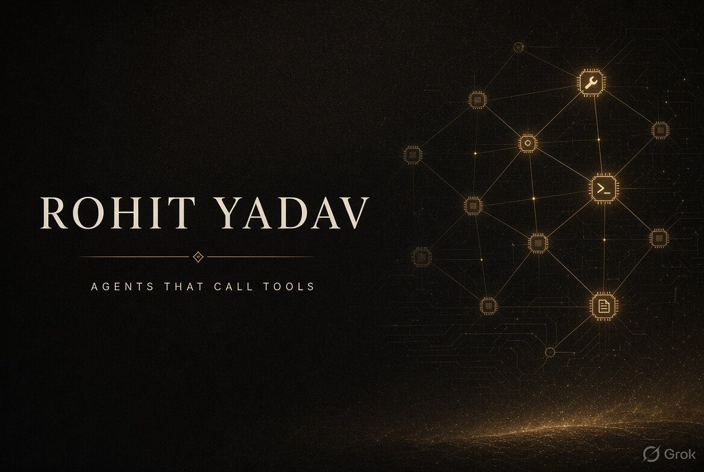

# Botta Rohit Yadav

**B.Tech CSE (IoT)** · Raghu Engineering College · Visakhapatnam

---

## About

I pick the data model first. If the world is rows, I use rows. If the world is a lineage, I use a graph. If the student needs a check, I call a tool.

I build backends and agents in **C# / .NET**, **Python**, **TypeScript**, and **Java**. Lately that includes a LangChain + Gemini programming tutor that calls MCP tools instead of guessing a prime check, and a Neo4j graph of Indian classical music lineages.

---

## Projects

### 1. Programming tutor agent — LangChain, Gemini, MCP
**Now.** A Python programming tutor. Concepts get an explanation. Checks go through MCP tools, then the agent explains the result in plain language.

`Python` `LangChain` `Gemini` `MCP` `LangGraph`

[Source](https://github.com/rohit-dev45/programming-tutor-agent) · [Demo video](https://github.com/rohit-dev45/programming-tutor-agent/blob/main/docs/programming-tutor-agent/docs/demo.mp4)

---

### 2. Parampara — living graph of Indian classical music
`TypeScript` `Neo4j` `Cypher`

[Live demo](https://parampara-ashy.vercel.app/) · [Source](https://github.com/rohit-dev45/parampara)

---

## Tech stack

`C#` `Python` `TypeScript` `Java` `LangChain` `LangGraph` `MCP` `Gemini` `.NET 8` `EF Core` `Neo4j` `SQL Server` `AWS` `Docker`

---

## Contact

**[programming-tutor-agent](https://github.com/rohit-dev45/programming-tutor-agent)** · **[parampara](https://parampara-ashy.vercel.app/)** · **[portfolio](https://rohityadavportfolio.lovable.app/)** · **[email](mailto:rohit.botta5@gmail.com)**

